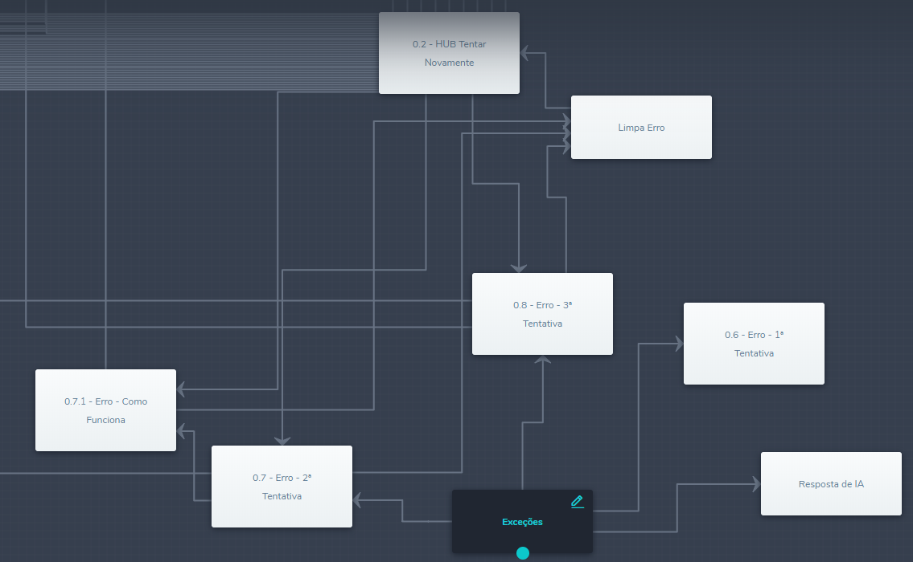

# BLiP Builder Utils
**DISCLAIMER: still in very early development stage.**

## Usage
This tool can either be run directly from *VisualStudio* or via command line using
`dotnet build` and `dotnet run`. The latter has argument-rich CLI possibility.

## Current features
1. [Creation of an exit hub](#exit-hub)

## Exit Hub
This feature creates a universal hub from a single box that connects it to any other possible box with a single exit condition for each. What defines if a box is possible to be linked or not is whether it as a "UserInput" action or not.

The condition that will be used is if the `variable` defined by the user is **equal** to the title of a box. For example, if you want to go to a box called *Welcome*, the value of the set variable must be **Welcome**. The main objective of this feature is to help on redirecting users back to where they were on the conversational flow before they sent an unexpected input to the Chatbot.

To make sure it works, place the following `javascript` snippet on the Entering Actions section of your Exception block:
```javascript
// Receive the variables as parameters
// state is the name of the state the user was when an unexpected input was entered (state.previous.name), while redirect is the variable where the return will be saved
// the redirect variable is required to filter any outputs directly from the Exception block to be saved on state, causing a loop
function run(state, redirect) {
    // place in the conditional the state.name of every block that can be an output of the Exceptions block
    if([...]) return redirect; 
	else return state;
}
```

A practical example is the following code: 
```javascript
// Receive the variables as parameters
function run(state, redirect) {
    if(state === "0.6 - Erro - 1ª Tentativa" ||
	   state === "0.7 - Erro - 2ª Tentativa" ||
	   state === "0.8 - Erro - 3ª Tentativa" ||
	   state === "Resposta de IA" ||
	   state === "0.7.1 - Erro - Como Funciona") return redirect;
	else return state;
}
```


Remember to provide the return variable a Builder variable name to save
